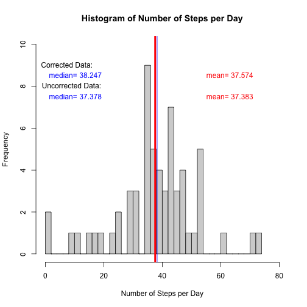

## Loading and preprocessing the data
The following processing of data was performed first:  
1. We unziped file "activity.zip" to working directory    
2. Loaded file into R as data_activity variable  
3. Loaded dplyr and lubricate libraries  
4. Transformed data to datatable format for work with dplyr and saved as variable dttbl  
5. Changed date format of column date to PositX format  
6. Added new columns TypeOfDay(weekend or workday) and Day(day of week) which were derived from the column date (this information will be used in the last part of the assignment)


```r
fileName <- "activity.zip"
unzip(fileName)

# Load test set and description of activities
path_activity<-"./activity.csv"
data_activity<-read.csv(path_activity)
library(dplyr)
library(lubridate)
dttbl<-tbl_df(data_activity)
dttbl$date<-ymd(dttbl$date)
#remove unused variable
rm(data_activity)

dttbl<-dttbl%>% mutate(Day=weekdays(date))


# Create a function to classify day of the week into the "Weekday" or "Weekend" 
selectday <- function(argmnt) {
    
  if(argmnt %in% c('Saturday','Sunday')){
  TypeOfDay<-"Weekend"
  }else{ 
  TypeOfDay<-"Weekday"
  }
  
  return(TypeOfDay)
}


dttbl<-dttbl%>%mutate(TypeOfDay=sapply(Day,selectday))
head(dttbl)
```

```
## Source: local data frame [6 x 5]
## 
##   steps       date interval    Day TypeOfDay
## 1    NA 2012-10-01        0 Monday   Weekday
## 2    NA 2012-10-01        5 Monday   Weekday
## 3    NA 2012-10-01       10 Monday   Weekday
## 4    NA 2012-10-01       15 Monday   Weekday
## 5    NA 2012-10-01       20 Monday   Weekday
## 6    NA 2012-10-01       25 Monday   Weekday
```

```r
table(dttbl$TypeOfDay)
```

```
## 
## Weekday Weekend 
##   12960    4608
```

```r
dttbl_bydate_mean<-dttbl%>%group_by(date) %>% summarize(mean(steps))
names(dttbl_bydate_mean)<-c("date","MeanSteps")
```


## What is mean total number of steps taken per day?
1. We grouped data by the date and made a histogram of average number of steps throughout a day.  
2. The median of this distrubution (blue) was slightly smaller than mean (red) of the distrubution.


```r
hist(dttbl_bydate_mean$MeanSteps,xlab="Number of Steps per Day", main="Histogram of Number of Steps per Day",xlim=c(0,80),ylim=c(0,10),breaks=50,col="lightgray")
abline(v=mean(dttbl_bydate_mean$MeanSteps,na.rm=TRUE),col="red",lwd=4)
abline(v=median(dttbl_bydate_mean$MeanSteps,na.rm = TRUE),col="blue",lwd=1)

usr <- par("usr")

label_median<-paste("median=",round(median(dttbl_bydate_mean$MeanSteps,na.rm = TRUE),3))
label_mean<-paste("mean=",round(mean(dttbl_bydate_mean$MeanSteps,na.rm = TRUE),3))

text(usr[1],usr[4],labels=label_median,adj = c(-0.75,8), col="blue")
text(usr[2],usr[4],labels=label_mean,adj=c(1.75,8),col="red")
```

 

## What is the average daily activity pattern?
1. We grouped original data by time interval and plotted them as average number of steps taken at different time intervals througthout a day (NA values of number of steps were ommited). 
2. The highest activity was observed at the time interval number 835 wih maximum activity 206.  


```r
dttbl_interval_mean<-dttbl%>%group_by(interval) %>% summarize(MeanSteps=mean(steps,na.rm = TRUE))

MyMax<-max(dttbl_interval_mean$MeanSteps)
MyMaxInt<-dttbl_interval_mean$interval[which(dttbl_interval_mean$MeanSteps==MyMax)]
label_TI<-paste("Dependence of the Average Activity on the Time Interval of the Day")

plot(dttbl_interval_mean$interval,dttbl_interval_mean$MeanSteps,"l",lwd=2,col="red",xlab="Time Interval",ylab="Mean Number of Steps",main=label_TI,ylim=c(0,250))
abline(v=MyMaxInt,col="green",lwd=3)

points(dttbl_interval_mean$interval,dttbl_interval_mean$MeanSteps,pch=19,cex=0.5,col="blue")

usr <- par("usr")

label_MyMax<-paste("Maximum Avarage Activity")
label_MyMaxInt<-paste("Time Interval")

points(MyMaxInt,MyMax,pch=19,col="red")

text(usr[1],usr[4],labels=paste("(",MyMaxInt,",",round(MyMax,2),")",sep=""),adj = c(-2.0,5),col="dark red")
text(usr[1],usr[4],labels=paste("(",label_MyMaxInt,", ",label_MyMax,")",sep=""),adj = c(-0.3,2),col="blue")
```

 


## Imputing missing values  
1. Dataset contains 2304 missing values (number of NAs) in the variable "steps".  
2. Further analysis showed that datasets for 8 days are missing entirely. We identified days of the week
at which activity data (variable steps) were missing. This will be used bellow for data imputing.  

```r
print(paste("Number of NA equals",sum(is.na(dttbl$steps))))
```

```
## [1] "Number of NA equals 2304"
```

```r
NAtble<-dttbl[is.na(dttbl$steps),]
tbl<-table(NAtble$date)
sum(tbl)
```

```
## [1] 2304
```

```r
MissingDataDays<-as.data.frame(cbind(names(tbl),weekdays(ymd(names(tbl)))))
colnames(MissingDataDays)<-c("DaysWithMissingData","Day")
MissingDataDays
```

```
##   DaysWithMissingData       Day
## 1          2012-10-01    Monday
## 2          2012-10-08    Monday
## 3          2012-11-01  Thursday
## 4          2012-11-04    Sunday
## 5          2012-11-09    Friday
## 6          2012-11-10  Saturday
## 7          2012-11-14 Wednesday
## 8          2012-11-30    Friday
```
3. To impute missing values, we replaced NAs at days with missing values with the average steps taken at corresponding day of the week. The latter were calculated from original dataset with removed NAs. New dataset is called dttblEd (data table edited).  

```r
AvDay<-dttbl%>%group_by(Day)%>%filter(!is.na(steps))%>%summarize(DayMeans=mean(steps,na.rm = TRUE))
dttblEd<-dttbl
for (i in 1:nrow(dttblEd)){
  
  if(is.na(dttblEd$steps[i])){
      for (j in 1:nrow(AvDay))
      if(as.character(dttblEd$Day[i])==as.character(AvDay$Day[j]))dttblEd$steps[i]<-AvDay$DayMeans[j]
  }
  }
```
  
4. We created a new histogram of the total number of steps taken each day and calculate the mean and the median. Our strategy of imputing of NAs lead to the increase in both median and mean values and also changed relation between mean and median: mean (red) became higher than median (blue). New and old data are shown on the graph.  
  

```r
dttblEd_bydate_mean<-dttblEd%>%group_by(date) %>% summarize(mean(steps))
names(dttblEd_bydate_mean)<-c("date","MeanSteps")


hist(dttblEd_bydate_mean$MeanSteps,xlab="Number of Steps per Day", main="Histogram of Number of Steps per Day",xlim=c(0,80),ylim=c(0,10),breaks=50,col="lightgray")
abline(v=mean(dttblEd_bydate_mean$MeanSteps,na.rm=TRUE),col="red",lwd=4)
abline(v=median(dttblEd_bydate_mean$MeanSteps,na.rm = TRUE),col="blue",lwd=1)

usr <- par("usr")

label_median<-paste("median=",round(median(dttblEd_bydate_mean$MeanSteps,na.rm = TRUE),3))
label_mean<-paste("mean=",round(mean(dttblEd_bydate_mean$MeanSteps,na.rm = TRUE),3))

text(usr[1],usr[4],labels="Corrected Data:",adj = c(-0.1,6), col="black")
text(usr[1],usr[4],labels=label_median,adj = c(-0.25,8), col="blue")
text(usr[2],usr[4],labels=label_mean,adj=c(1.75,8),col="red")

label_median<-paste("median=",round(median(dttbl_bydate_mean$MeanSteps,na.rm = TRUE),3))
label_mean<-paste("mean=",round(mean(dttbl_bydate_mean$MeanSteps,na.rm = TRUE),3))


text(usr[1],usr[4],labels="Uncorrected Data:",adj = c(-0.1,10), col="black")
text(usr[1],usr[4],labels=label_median,adj = c(-0.25,12), col="blue")
text(usr[2],usr[4],labels=label_mean,adj=c(1.75,12),col="red")
```

 
## Are there differences in activity patterns between weekdays and weekends?
1. In dataset  with imputed values of steps we grouped data by the day of the week (weekday vs weekend)
and compared average number of steps during the day.  
2. It appears that activity during workday has two peaks: one in the morning and another toward the end of the day. During weekend activity distributed more uniformly (during active hours).  


```r
library(ggplot2)
byTypeOfDay<-dttblEd%>%group_by(TypeOfDay,interval)%>%summarize(Means=mean(steps))

p<-ggplot(byTypeOfDay, aes(interval,Means))+ geom_line(colour=c("red"),size=1.)
p+facet_grid(TypeOfDay~.)+xlab("Intreval Number" )+ylab("Average number of steps for a given interval")+ggtitle("Comparison of number of steps on weekend and weekday")+geom_smooth(colour=c("blue"),method="loess",se=T)+geom_hline(aes(yintercept=mean(Means)),data=byTypeOfDay)+geom_hline(aes(yintercept=mean(Means)),data=byTypeOfDay)
```

 
